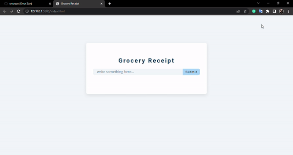

<h1>Grocery Receipt</h1>

<h3>Used Tech</h3>

HTML5, CSS3 and JavaScript

Learned how to edit and delete items dynamically added to the list. It has been tried to save the entered items to local storage and to recall them from local storage when the page is opened again even if the page is closed.

